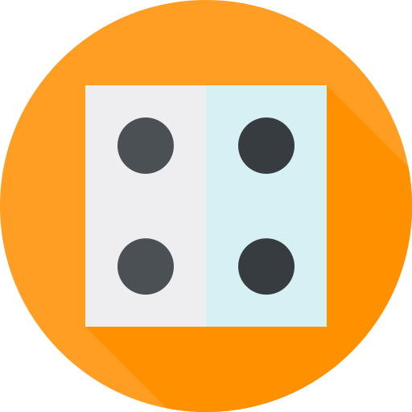

# Mastermind Game
#### Rules
 - Try to guess the pattern, in both order and color, within ten turns.

 - After submitting a row, a small black peg is placed for each code peg from the guess which is correct in both color and position.

 - A white peg indicates the existence of a correct color code peg placed in the wrong position.

 - More info on Wikipedia [(link)](https://en.wikipedia.org/wiki/Mastermind_(board_game))

#### Links
 - [(Click here to play)](https://db-mastermind.netlify.app/)
